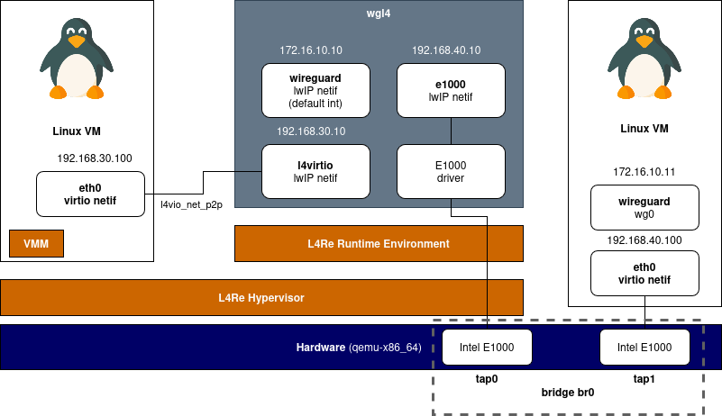

# L4Re E1000 driver

# Test topology


# lwIP patches
```
lwipopts.h
#define IP_FORWARD                      1

opt.h
#define IP_FORWARD                      1
#define CHECKSUM_GEN_ICMP               0 // tbv


ip4.c
    //IPH_CHKSUM_SET(iphdr, 0);
    
```

# Credits
- https://wiki.osdev.org/Intel_Ethernet_i217
- https://github.com/smartalock/wireguard-lwip
